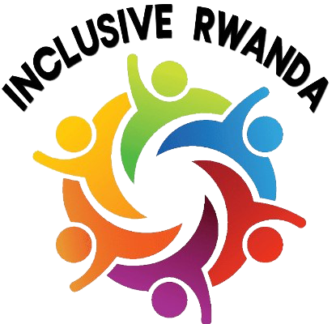

# Inclusive Rwanda - Web Application

## 📋 Project Overview

**Inclusive Rwanda** is a full-featured web application designed to promote disability inclusion and accessibility across Rwanda. The platform provides information about services, partnerships, news updates, and allows visitors to contact the organization.

### 🌟 Key Features

- **Public Website** with 6 pages (Home, About, Services, Partners, News, Contact)
- **Admin Panel** for content management
- **Contact Form** with email notifications
- **News & Updates** system
- **Services Management**
- **Partners Management**
- **Image Upload** functionality
- **Responsive Design** (mobile-friendly)
- **Accessibility Features** (ARIA labels, screen reader support)
- **Secure Authentication** system

---

## 🛠️ Technology Stack

### Frontend
- **HTML5** - Structure
- **CSS3** - Styling and responsive design
- **JavaScript** - Interactivity and form validation

### Backend
- **PHP 7.4+** - Server-side logic
- **MySQL** - Database management
- **PHPMailer** - Email notifications

### Security Features
- Password hashing (bcrypt)
- SQL injection prevention (prepared statements)
- XSS protection (input sanitization)
- Session management
- CSRF protection

---

## 📁 Project Structure